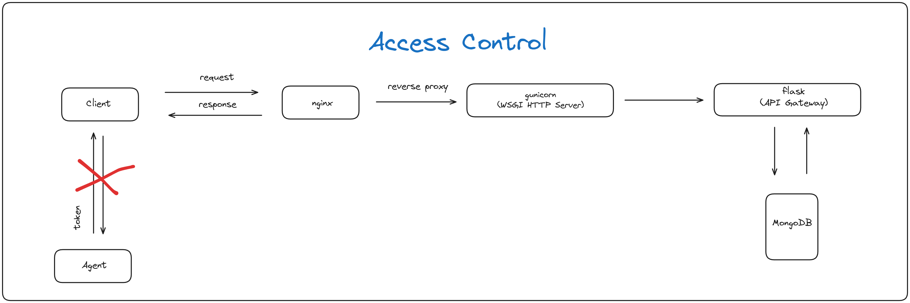

Sure! Below is a detailed **README** file in English that explains the architecture (MVC) and the authentication method (JWT) for your project.

---

# Authentication API

This project is a **Flask-based Authentication API** built using the **MVC (Model-View-Controller)** architecture. The API uses **JWT (JSON Web Tokens)** for authentication and **MongoDB** for storing user data (email and password). The project also includes a **Nginx** server for load balancing and proxying requests, and is orchestrated with **Docker Compose**.

## Table of Contents
1. [Project Structure](#project-structure)
2. [Technologies Used](#technologies-used)
3. [Authentication Flow](#authentication-flow)
4. [API Endpoints](#api-endpoints)
5. [Running the Application](#running-the-application)
6. [Environment Variables](#environment-variables)
7. [Gunicorn and Nginx](#gunicorn-and-nginx)

## Project Structure

This project follows the **MVC (Model-View-Controller)** architecture, which separates the application into three distinct layers:
- **Model (M)**: Manages the data and interacts with MongoDB.
- **View (V)**: Responsible for formatting and returning HTTP responses (usually in JSON).
- **Controller (C)**: Handles the business logic, coordinates models and views, and processes requests.

```
/acess-control
    ├── app
    │   ├── app.py
    │   ├── __init__.py
    │   ├── config
    │   │   ├── config.py
    │   │   └── __init__.py
    │   ├── controllers
    │   │   ├── auth_controller.py
    │   │   └── __init__.py
    │   ├── models
    │   │   ├── __init__.py
    │   │   └── user.py
    │   └── views
    │       ├── auth_view.py
    │       └── __init__.py
    ├── nginx
    │   ├── config
    │   │   └── nginx.conf
    │   └── Dockerfile
    ├── docker-compose.yaml
    ├── Dockerfile
    ├── requirements.txt
    └── README.md

```

## Technologies Used

- **Flask**: A micro web framework for building the API.
- **Gunicorn**: A WSGI HTTP Server to run Flask in production.
- **MongoDB**: NoSQL database for storing user data.
- **Nginx**: Reverse proxy server to manage load balancing and routing.
- **JWT (JSON Web Tokens)**: Used for session-based authentication.
- **Docker**: Containerization of the services (Flask, MongoDB, Nginx).
- **Docker Compose**: Orchestration of the multi-container setup.

## Authentication Flow

The authentication in this API is based on **JWT (JSON Web Tokens)**. Here's how it works:

1. **User Registration**: Users can register by providing an email and password. The password is securely hashed using `bcrypt` before being stored in the database.
2. **User Login**: Users provide their email and password to log in. If the credentials are correct, a **JWT token** is generated and returned to the user. This token includes an expiration time (e.g., 1 hour).
3. **Token-Based Authentication**: Once logged in, the user includes the JWT in the `Authorization` header for subsequent requests to authenticate and access protected routes.

### How JWT Works:
- JWT consists of three parts: **Header**, **Payload**, and **Signature**.
  - **Header**: Specifies the algorithm used (e.g., HS256).
  - **Payload**: Contains the data, such as user ID and token expiration time.
  - **Signature**: A hash to ensure the token has not been tampered with.

Example of a JWT token:
```
eyJhbGciOiJIUzI1NiIsInR5cCI6IkpXVCJ9.
eyJ1c2VyX2lkIjoiNjEyZmEzZjg3ZDg0OTkwMDA3ZjE1YmEiLCJleHAiOjE2MzM0ODc4MzB9.
V2RzC3Fq4c1ViU3yqOcW8YlHfW1ehH3lDpTO9q_pYOE
```

### Token Expiration:
The token is valid for a specific time period (e.g., 1 hour). After expiration, the user needs to log in again to receive a new token.

## API Endpoints

### 1. **POST /auth/register**
Registers a new user by providing an email and password.

**Request:**
```json
{
  "email": "user@example.com",
  "password": "password123"
}
```

**Response:**
```json
{
  "status": "success",
  "data": "User registered successfully"
}
```

### 2. **POST /auth/login**
Logs in a user and returns a JWT token.

**Request:**
```json
{
  "email": "user@example.com",
  "password": "password123"
}
```

**Response:**
```json
{
  "status": "success",
  "data": {
    "token": "JWT_TOKEN_HERE"
  }
}
```

## Running the Application

To run the application, ensure you have **Docker** and **Docker Compose** installed. Follow the steps below to get the system up and running:

1. Clone the repository via HTTPS or SSH.

2. Build and start the containers using Docker Compose:
   ```bash
   docker-compose up --build
   ```

3. The application will be running on `http://localhost`.

### Accessing the API

- Nginx proxies requests from `http://localhost` to the Flask application.
- Use the `/auth/register` and `/auth/login` endpoints to interact with the authentication API.

## Environment Variables

To store sensitive information such as the **SECRET_KEY** and **MONGO_URI**, we use a `.env` file. The `.env` file will contain all the environment variables required by the Flask application.

### Create a `.env` File

1. In the root directory of your project, create a `.env` file.

2. Add the following environment variables to the `.env` file:

```bash
FLASK_APP=app.py
FLASK_ENV=development
MONGO_URI=mongodb://mongo:27017/auth_db
SECRET_KEY=your_secret_key_here
```

- **FLASK_APP**: The entry point for your Flask application.
- **FLASK_ENV**: Specifies the environment for Flask (`development`, `production`).
- **MONGO_URI**: Connection URI for MongoDB, pointing to the `mongo` service defined in `docker-compose.yml`.
- **SECRET_KEY**: A secret key used for signing JWT tokens (ensure this is kept secure).

## Gunicorn and Nginx

### Gunicorn Command Explanation:

In the **Dockerfile**, the Gunicorn server is configured with the following command:

```bash
CMD ["gunicorn", "-w", "4", "-b", "0.0.0.0:5000", "app:app"]
```

- **`gunicorn`**: The command that starts Gunicorn, the WSGI server for running Flask applications.
- **`-w 4`**: Specifies the number of **workers** (processes) that Gunicorn should use to handle requests. In this case, it uses 4 workers, meaning the application can handle multiple requests simultaneously.
- **`-b 0.0.0.0:5000`**: Defines the **bind address** and port where Gunicorn will listen. It binds to port `5000` inside the container, and `0.0.0.0` means it will accept connections from any IP.
- **`app:app`**: Refers to the Flask application. The first `app` is the name of the Python file (`app.py`), and the second `app` is the Flask application instance (`app = Flask(__name__)`).

### Execution Flow:

1. **Nginx** listens on port **80** (exposed by the container) and acts as the entry point for external traffic.
2. Nginx forwards the requests to **Gunicorn**, which is listening on port **5000** inside the container.
3. **Gunicorn** uses its **workers** to process the requests concurrently and dispatches the logic to the Flask application.
4. Flask processes the request and sends a response back to **Gunicorn**, which then returns it to **Nginx**.
5. **Nginx** sends the final response back to the client.


